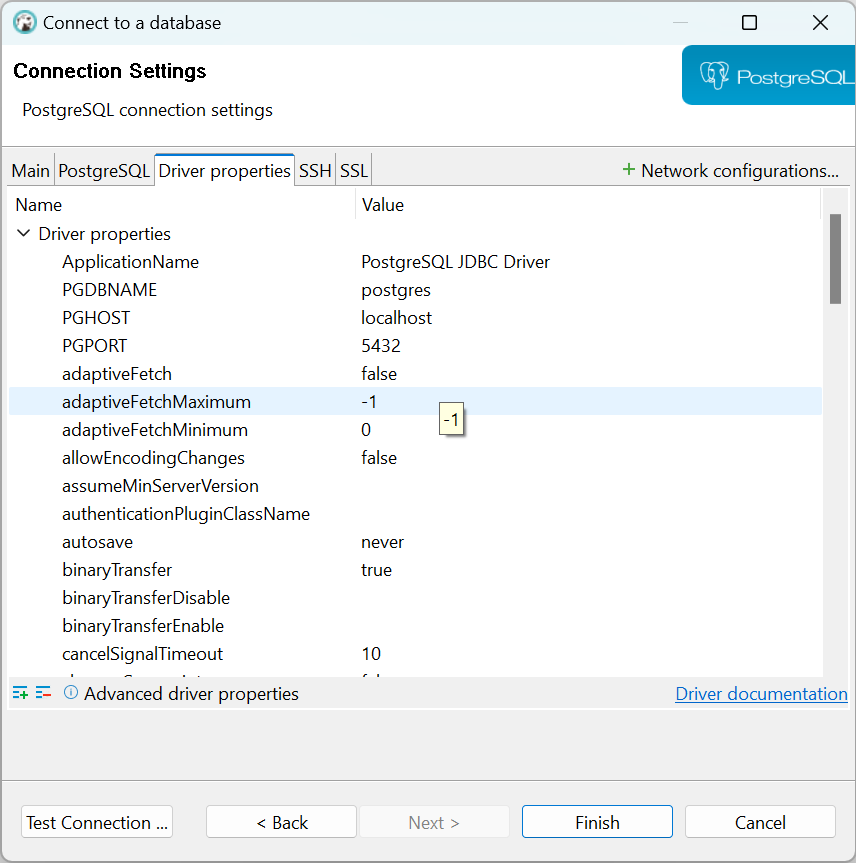
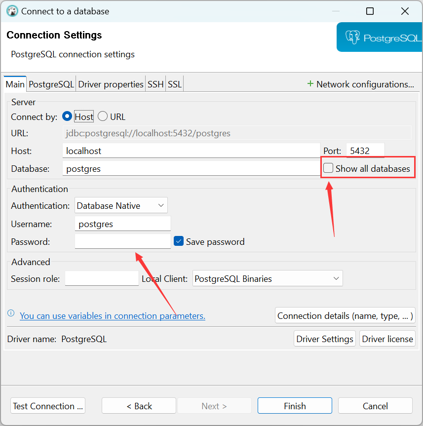
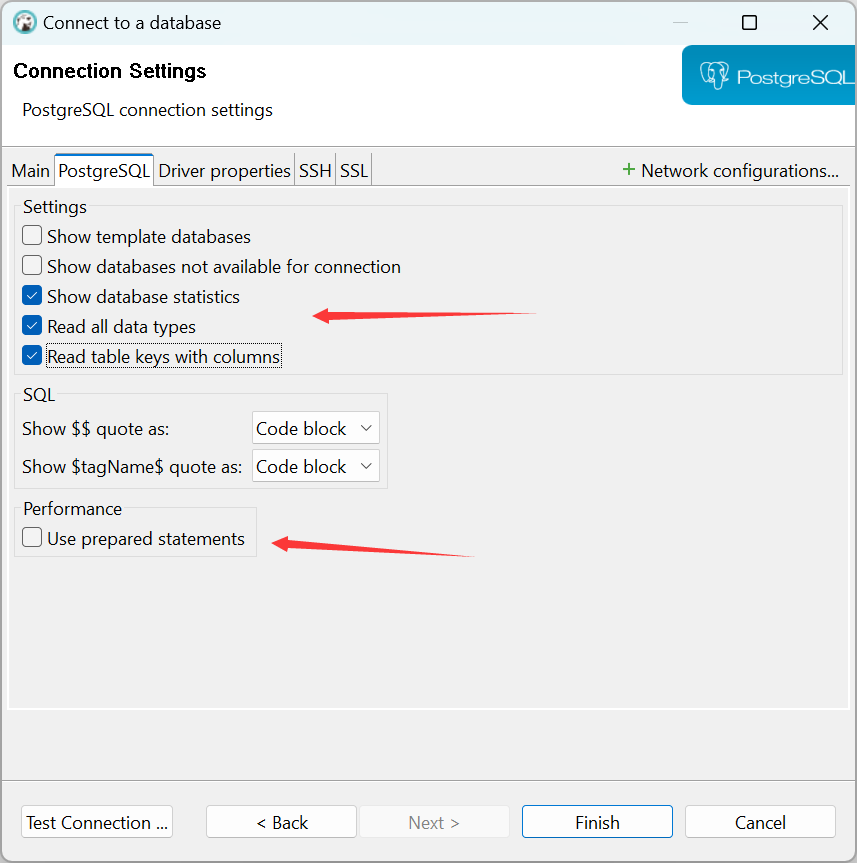
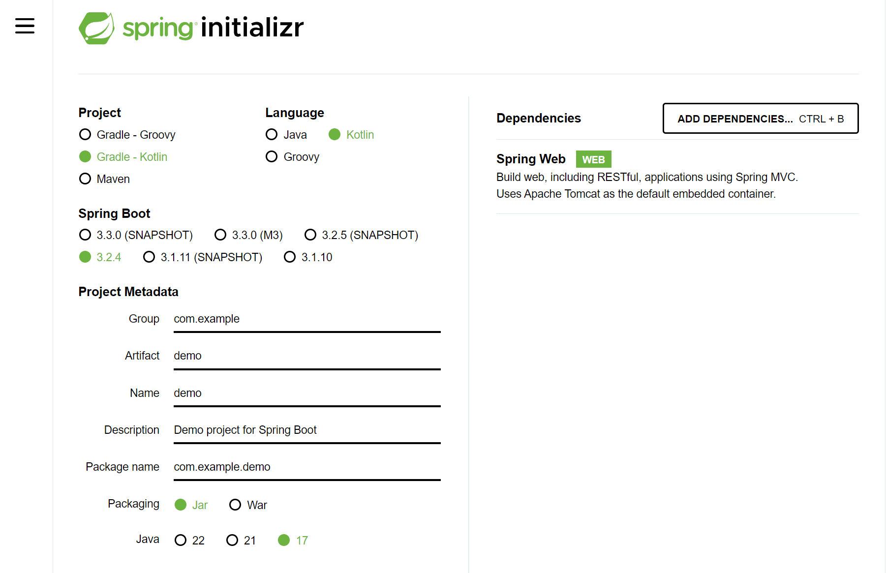

# Windows Manual For Programmers

## Chocolatey

The Package Manager for Windows

> Official Site: https://chocolatey.org/install

```bash
# Administrator Powershell Run
Set-ExecutionPolicy Bypass -Scope Process -Force; [System.Net.ServicePointManager]::SecurityProtocol = [System.Net.ServicePointManager]::SecurityProtocol -bor 3072; iex ((New-Object System.Net.WebClient).DownloadString('https://community.chocolatey.org/install.ps1'))

# check install
choco
```

## Proxy

### Install

```bash
choco install clash-for-windows
```

### Config

Buy  `air plane`

## Git

> Download Link : https://git-scm.com/download

### Install

Run Installer.

### Config

```bash
# check version
git --version

# commit info
git config --global user.email "myemail@example.com"
git config --global user.name "My Name"

# custom git log info
# https://www.liaoxuefeng.com/wiki/896043488029600/898732837407424
git config --global alias.lg "log --color --graph --pretty=format:'%Cred%h%Creset -%C(yellow)%d%Creset %s %Cgreen(%cr) %C(bold blue)<%an>%Creset' --abbrev-commit"
```

### Usage

> Git command list (Chinese): https://www.ruanyifeng.com/blog/2015/12/git-cheat-sheet.html

```bash
# repo
git init
git clone <remote link>

# show info
git status
git log

##### commit #####
git add .
git add *
git commit -am "commit message"
git pull
git push

##### branch #####
# list all local and remote branchs
git branch -a
# list remote branch links
git remote -v
# switch to <brach-name>
git checkout <brach-name>
# create and switch to <branch-name>
git checkout -b <branch-name>
# delete <branch-name>
git branch -d <branch-name>
# delete remote <branch-name>
git push origin --delete <branch-name>

##### tag #####
# list tags
git tag
# add <tag-name> for current commit
git tag <tag-name>
# push <tag> to <remote>
git push <remote> <tag>
# push all tags
git push <remote> --tags
```

### Github CLI

- Download Installer: https://cli.github.com/

- Login

```bash
gh auth login
```

- Generate token at: https://github.com/settings/tokens

## Markdown

### Typora

> Official Site: https://typora.io

- Purchase: \$14.99, ￥89
- Preferences
- Add Themes
- [Typora plugin](https://github.com/obgnail/typora_plugin): Typora plugins and feature enhancement tools.

### Mark Text

> Github:https://github.com/marktext/marktext

- Open Source And Free

## Oh My Posh

> Official Site: https://ohmyposh.dev/

### Install

```bash
# may not work
winget install JanDeDobbeleer.OhMyPosh -s winget
# quickly
Set-ExecutionPolicy Bypass -Scope Process -Force; Invoke-Expression ((New-Object System.Net.WebClient).DownloadString('https://ohmyposh.dev/install.ps1'))
```

### Config

```bash
# Document: https://ohmyposh.dev/docs/installation/prompt
# create $PROFILE file if not exist
New-Item -Path $PROFILE -Type File -Force

# Solve PowerShell blocks running local scripts
Set-ExecutionPolicy -ExecutionPolicy RemoteSigned -Scope LocalMachine

# edit $PROFILE
notepad $PROFILE
```

add config by using  the [ys](https://ohmyposh.dev/docs/themes#ys) theme

```bash
# in $PROFILE
oh-my-posh init pwsh --config "$env:POSH_THEMES_PATH/ys.omp.json" | Invoke-Expression
```

### Font

**Install Nerd Fonts** (Support icons for some themes). Download fonts at: https://www.nerdfonts.com/font-downloads, For Example  `JetBrainsMono Nerd Font`.

**Config terminal font**. This can be easily done by modifying the Windows Terminal settings (default shortcut: `CTRL + SHIFT + ,`). In your `settings.json` file, add the `font.face` attribute under the `defaults` attribute in `profiles`:

```json
{
    "profiles": {
        "defaults": {
            "font": {
                "face": "JetBrainsMono Nerd Font"
            }
        }
    }
}
```

### Useful tools

✨ **PSReadLine**: [zsh-autosuggestion](https://github.com/zsh-users/zsh-autosuggestions) alternative for powershell

> Github: https://github.com/PowerShell/PSReadLine

Install from PowerShellGallery

```bash
# get posh version
Get-Host

# install the latest PowerShellGet
Install-Module -Name PowerShellGet -Force

# After installing PowerShellGet, you can get the latest prerelease version of PSReadLine by running
Install-Module PSReadLine -AllowPrerelease -Force
```
Add Config: `notepad $PROFILE`

```shell
# PSReadLine
Import-Module PSReadLine
# Enable Prediction History
Set-PSReadLineOption -PredictionSource History
# Advanced Autocompletion for arrow keys
Set-PSReadlineKeyHandler -Key UpArrow -Function HistorySearchBackward
Set-PSReadlineKeyHandler -Key DownArrow -Function HistorySearchForward
```

✨ **zoxide**: zoxide is a **smarter cd command**, inspired by `z` and `autojump`.

>  Github: https://github.com/ajeetdsouza/zoxide

Install:

```bash
# not work for me
winget install ajeetdsouza.zoxide

# I use choco
choco install zoxide
```

Add Config: `notepad $PROFILE`

```bash
# zoxide
Invoke-Expression (& { (zoxide init powershell | Out-String) })
```


### Windows Terminal Hotkeys

| Operation | Hotkey           |
| --------- | ---------------- |
| Copy      | Ctrl + Shift + C |
| Past      | Ctrl + Shift + V |


## VSCode

> Official Site: https://code.visualstudio.com/

### Install

- Option1: Download Installer from official site.
- Option2: Install with Chocolatey

```bash
# vscode
choco install vscode
# vscodium
choco install vscodium
```

### Preferences

- Theme: One Dark Pro
- Icons: Material icon theme
- Font: JetBrainsMono Nerd Font
- Auto Save
- Change Hotkey: Format Document: `Shift+Alt+F ---> Alt+F`

### Codeium

✨ **Codeium**: A free AI powered toolkit for developers

> Official Site: https://codeium.com/

- Register an account
- Download extension
- Login

### Fitten Code

> Official Site: https://code.fittentech.com/

### VSCodium 

VSCodium is a community-driven, freely-licensed binary distribution of Microsoft’s editor VS Code.

Microsoft’s `vscode` source code is open source (MIT-licensed), but the product available for download (Visual Studio Code) is licensed under [this not-FLOSS license](https://code.visualstudio.com/license) and contains telemetry/tracking. According to [this comment](https://github.com/Microsoft/vscode/issues/60#issuecomment-161792005) from a Visual Studio Code maintainer.

> VSCodium Site: https://vscodium.com/

> **Warning**: VSCodium can not use `code` command.

### Hotkey

If you like Idea Key Bindings, Install extension `IntelliJ IDEA Keybindings`

Hotkeys May Change due to extension or customizing.

| Operation                | Hotkey                    |
| ------------------------ | ------------------------- |
| Comment/Uncomment        | Ctrl + /                  |
| Multiline Comment        | Alt + Shift + A           |
| Copy Line                | Ctrl + L                  |
| Move Line Up/Down        | Alt + up/down             |
| Copy line to Up/Down     | Shift + Alt + up/down     |
| Delete line              | Ctrl + X                  |
| Add / Reduce Indent      | Ctrl + ]/[                |
| New Line at Any Position | Ctrl + Enter              |
| Rename Variable          | Ctrl + D (N times)        |
| Format Document          | Shift + Alt + F (Alt + F) |
| Goto File Start/End      | Ctrl + Home/Ctrl + End    |
| Switch Tab               | Ctrl + Tab                |
| Show all symbols         | Ctrl +Shift + O           |
| Multi Cursor             | Alt + Left Click          |
| Multi Cursor             | Ctrl + Alt + Up/Down      |
| Block Select             | Shift + Alt + Left Drag   |


## Docker

> Official Site: https://www.docker.com/products/docker-desktop/
>
> Download Link: https://docs.docker.com/desktop/install/windows-install/
>
> Docker Hub:https://hub.docker.com/

### Setup WSL 2

> Documents: 
>
> https://docs.docker.com/desktop/wsl/
>
> https://learn.microsoft.com/en-us/windows/wsl/install

- Installed the WSL 2 feature on Windows. Search At Start: `Turn Windows features on and off`, Check both:

```bash
Virtual Machine Platform
Windows Subsystem for Linux
```

- Update WSL

```bash
# install update
wsl --update
```

Download and install the latest package: [WSL2 Linux kernel update package for x64 machines](https://wslstorestorage.blob.core.windows.net/wslblob/wsl_update_x64.msi).

- Install Linux distros.

```bash
# list installed Linux distributions and check the version of WSL
wsl -l -v

# install update
wsl --update

# list available distros
wsl -l -o
# install a distro
wsl --install -d <distro name>
# set default distr
wsl --set-default <distro name>

# upgrade the Linux distro to v2
wsl.exe --set-version <distro name> 2
# set v2 as the default version for future installations
wsl.exe --set-default-version 2
```

- Set up your Linux user info

Once you have installed WSL, you will need to create a user account and password for your newly installed Linux distribution.

Just run your linux distro from start menu.

### Install

> Documents: 
>
> https://docs.docker.com/desktop/install/windows-install/
>
> https://docs.docker.com/desktop/wsl/

Download and install the latest version of [Docker Desktop for Windows](https://desktop.docker.com/win/main/amd64/Docker Desktop Installer.exe).

### Config

Change Mirrors: Settings---Docker Engine

```json
{
  "builder": {
    "gc": {
      "defaultKeepStorage": "20GB",
      "enabled": true
    }
  },
  "experimental": false,
  "registry-mirrors": [
    "https://mirror.ccs.tencentyun.com/"
  ]
}
```

### Possible Error

```bash
Installing, this may take a few minutes...
WslRegisterDistribution failed with error: 0x8004032d
Error: 0x8004032d (null)
Press any key to continue...
```

Solution: [Enable `Virtual Machine Platform` Windows Feature](https://learn.microsoft.com/en-us/answers/questions/1424692/how-to-fix-wslregisterdistribution-failed-with-err).

## Database and Redis

### DBeaver

> Download Link: https://dbeaver.io/download/

👉 **Install**

Download and run Installer.

### Another Redis Desktop Manager

> Github: https://github.com/qishibo/AnotherRedisDesktopManager
>
> Download Link: https://github.com/qishibo/AnotherRedisDesktopManager/releases

👉 **Install**

Download and run Installer.

### run postgresql and redis

create `docker-compose.yaml`:

```yaml
# docker-compose.yaml
services:
  postgres:
    image: postgres:16-alpine
    restart: always
    ports:
      - 5432:5432
    environment:
      - POSTGRES_PASSWORD=very_secret_password # do not include $@
      - POSTGRES_USER=postgres

  redis:
    image: redis:latest
    restart: always
    ports:
      - 6379:6379
```

Then run:

```bash
docker compose up -d
```

### Test Postgresql connection

We need download database derive for the first run.



Input password and check Show all databases



You can check what you want:



## Python

> Python Official Site: https://www.python.org/downloads/

### Install

- Option1: Download from official site and run installer.
- Option2: Install with Chocolatey

```bash
choco install python
```

### Config

[PyPI tuna mirror](https://mirrors.tuna.tsinghua.edu.cn/help/pypi/):

```bash
# once
pip install scrapy -i https://pypi.tuna.tsinghua.edu.cn/simple some-package

# set as default
python -m pip install --upgrade pip
pip config set global.index-url https://pypi.tuna.tsinghua.edu.cn/simple
```

### VSCode Extension

- Python
- Black formatter
- Pylance

### conda

👉 **conda (miniconda)**

> Official Site: https://docs.anaconda.com/free/miniconda/miniconda-install/
>
> tuna: https://mirrors.tuna.tsinghua.edu.cn/anaconda/miniconda/

👉 **Config**

> tuna: https://mirrors.tuna.tsinghua.edu.cn/help/anaconda/

edit or create `.condarc` 。Windows can run `conda config --set show_channel_urls yes` to generate `.condarc` then change it:

```bash
channels:
  - defaults
show_channel_urls: true
default_channels:
  - https://mirrors.tuna.tsinghua.edu.cn/anaconda/pkgs/main
  - https://mirrors.tuna.tsinghua.edu.cn/anaconda/pkgs/r
  - https://mirrors.tuna.tsinghua.edu.cn/anaconda/pkgs/msys2
custom_channels:
  conda-forge: https://mirrors.tuna.tsinghua.edu.cn/anaconda/cloud
  msys2: https://mirrors.tuna.tsinghua.edu.cn/anaconda/cloud
  bioconda: https://mirrors.tuna.tsinghua.edu.cn/anaconda/cloud
  menpo: https://mirrors.tuna.tsinghua.edu.cn/anaconda/cloud
  pytorch: https://mirrors.tuna.tsinghua.edu.cn/anaconda/cloud
  pytorch-lts: https://mirrors.tuna.tsinghua.edu.cn/anaconda/cloud
  simpleitk: https://mirrors.tuna.tsinghua.edu.cn/anaconda/cloud
  deepmodeling: https://mirrors.tuna.tsinghua.edu.cn/anaconda/cloud/
```

👉 **Usage**:

```bash
# create a environment with specified python version and packages
conda create -n myenv python=3.9 numpy=1.23.5 astropy
# activate the environment:
conda activate myenv

# list envs
conda env list

# export all packages in myenv environment
conda activate myenv
conda env export > myenv.yml

# create a new environment from a myenv.yml
conda env create -f myenv.yml
```

👉 **Windows Terminal**:

Add miniconda prompt to windows terminal:

```json
{
  "altGrAliasing": true,
  "antialiasingMode": "grayscale",
  "closeOnExit": "automatic",
  "colorScheme": "Campbell",
  "commandline": "%windir%\\System32\\WindowsPowerShell\\v1.0\\powershell.exe -ExecutionPolicy ByPass -NoExit -Command \"& 'C:\\Users\\zuiai\\miniconda3\\shell\\condabin\\conda-hook.ps1' ; conda activate 'C:\\Users\\zuiai\\miniconda3' \"",
  "cursorShape": "bar",
  "font": {
    "size": 12
  },
  "guid": "{3ba1b1d8-9de1-41b7-bb7a-f7903c2e68d6}",
  "hidden": false,
  "historySize": 9001,
  "icon": "ms-appx:///ProfileIcons/{61c54bbd-c2c6-5271-96e7-009a87ff44bf}.png",
  "name": "MiniConda3",
  "padding": "8, 8, 8, 8",
  "snapOnInput": true,
  "startingDirectory": "%USERPROFILE%\\Desktop",
  "useAcrylic": false
}
```

## Golang

> Download Link: https://go.dev/dl/

### Install

Download and run installer.

```bash
# check version
go version

# check env
go env
```

### Config

```bash
# config proxy
go env -w GO111MODULE=on
go env -w GOPROXY=https://proxy.golang.com.cn/,direct
```

### VSCode Extension

- Go
- Go Test Explorer

Region folding: 

```json
"editor.foldingStrategy": "indentation"
```

```go
// region Title
// ...
// endregion
```


### Hello World

`mkdir hello && cd hello`

```bash
go mod init hello
```

Add code to `main.go`:

```go
// main.go
package main

import "fmt"

func main() {
    fmt.Println("hello world")
}
```
Run:

```bash
go run main.go
# or
go run .
```

## Java / Kotlin

### JDK

> Download Link: https://www.oracle.com/java/technologies/downloads/#jdk21-windows

There is no need to set env vars like `JAVA_HOME` when using java 21.

⚠️ **Warning**: According to https://docs.gradle.org/current/userguide/compatibility.html, Grable has limited support of java 22.

### Android Studio / Idea

> Download Link: https://developer.android.com/studio
>
> Idea Download Link: https://www.jetbrains.com/idea/download/?section=windows

Config gradle jdk: File---Settings---Build, Execution---Gradle

### Run Spring  Boot Project

> Spring Initializer: https://start.spring.io/



### Idea Hotkey

| Operation                                | Hotkey         |
| ---------------------------------------- | -------------- |
| `public static void main(String[] args)` | main + Tab     |
| `System.out.println()`                   | sout + Tab     |
| Quick Fixes                              | Alt + Enter    |
| Optimize imports                         | Ctrl + Alt + O |

**Editing**

| Operation                                    | Hotkey                    |
| -------------------------------------------- | ------------------------- |
| Select successively increasing code blocks   | Ctrl + W                  |
| Decrease current selection to previous state | Ctrl + Shift + W          |
| Comment/Uncomment                            | Ctrl + /                  |
| Block Comment                                | Ctrl + Shift + /          |
| Move Line Up/Down                            | Shift + Alt + up/down     |
| Duplicate Line                               | Ctrl + D                  |
| Cut line                                     | Ctrl + X                  |
| Replace                                      | Ctrl + R                  |
| Find                                         | Ctrl + F                  |
| Find Next/Previous                           | F3/Shift + F3             |
| Add / Reduce Indent                          | Tab / Shift + Tab         |
| Auto-indent line                             | Ctrl + Alt + I            |
| Start new line                               | Shift + Enter             |
| Smart line split                             | Ctrl + Enter              |
| Smart line join                              | Ctrl + Shift + j          |
| Multi Carets                                 | Alt + Shift + Left Click  |
| Multi Carets                                 | Click Mouse Middle Button |
| Collapse/Expand code block                   | Ctrl + `-/=`              |
| Rename                                       | Shift +F6                 |
| Override methods                             | Ctrl + O                  |
| Implement methods                            | Ctrl + I                  |
| Surround with...                             | Ctrl + Alt + T            |

**Navigation**

| Operation                      | Hotkey            |
| ------------------------------ | ----------------- |
| Open Symbol Go to  menu        | Ctrl + N          |
| Go to Line Start/End           | Home/End          |
| Go to File Start/End           | Ctrl + Home/End   |
| Go to Line                     | Ctrl + G          |
| Go to declaration              | Ctrl + B          |
| Go to implementation(s)        | Ctrl + Alt + B    |
| Go to type declaration         | Ctrl + Shift  + B |
| Go to super-method/super-class | Ctrl + U          |
| Go to code block start/end     | Ctrl + [/]        |
| Go to Test                     | Ctrl + Shift + T  |
| Goto Matching Brace            | Ctrl + Shift + M  |
| Go to previous/next method     | Alt + up/down     |
| Switch Tab                     | Ctrl + Tab        |

**Custom**

| Operation   | Hotkey    |
| ----------- | --------- |
| Format Code | Ctrl + S  |
| Terminal    | Ctrl + \` |

## Web

### nodejs

> Download Link:https://nodejs.org/en
>
> nvm for Windows: https://github.com/coreybutler/nvm-windows

```bash
# list all versions
nvm list

# list online
nvm list available

# install lts
nvm install lts

nvm use 21.7.1
```

### Config

Change Npm Mirror.

⚠️ **Warning**: after change to other mirror, we can not use  `npm search`

```bash
# check mirror
npm config get registry

# change mirror
npm config set registry https://registry.npmmirror.com

# change to default mirror
npm config set registry https://registry.npmjs.org
```

**pnpm**

```bash
npm install -g pnpm
```

### Vue

> Vuejs Site: https://vuejs.org/guide/quick-start.html

```bash
npm create vue@latest
```

Nuxt using [vitesse-nuxt3](https://github.com/antfu/vitesse-nuxt3) template

```bash
npx degit antfu/vitesse-nuxt3 my-nuxt3-app
```


### React

```bash
npx create-next-app@latest
```

### VSCode Extension

- Vue
- Eslint

## Flutter

> Install document: https://docs.flutter.dev/get-started/install


## Mimi Program

> Guide:https://developers.weixin.qq.com/miniprogram/en/dev/framework/quickstart/getstart.html
>
> Weixin DevTools:https://developers.weixin.qq.com/miniprogram/dev/devtools/download.html

### uni-app

Create uni-app

```bash
# Create a project developed with typescript
npx degit dcloudio/uni-preset-vue#vite-ts my-vue3-project

# Update to the latest official version
npx @dcloudio/uvm@latest
# Update to the official version specified version
npx @dcloudio/uvm@latest 3.2.0

npm run dev:mp-weixin
```

## C/C++

### Visual Studio 2022

> Download Link: https://visualstudio.microsoft.com/downloads/


## Windows Hotkeys

### Windows 11 New Features

| Operation               | Hotkey  |
| ----------------------- | ------- |
| Open Snap Layout        | Win + Z |
| Open Microsoft  Copilot | Win + C |

### Document Edit

| Operation                             | Hotkey   |
| ------------------------------------- | -------- |
| Cut                                   | Ctrl + X |
| Copy                                  | Ctrl + C |
| Paste                                 | Ctrl + V |
| Clipboard History                     | Win + V  |
| Undo                                  | Ctrl + Z |
| Redo                                  | Ctrl + Y |
| Bold                                  | Ctrl + B |
| Italic                                | Ctrl + I |
| Underline                             | Ctrl + U |
| Move cursor to Start of line          | Home     |
| Move cursor to End of line            | End      |
| Move cursor to Start of next word     | Ctrl + → |
| Move cursor to Start of previous word | Ctrl + ← |

### Window and Desktop

| Operation           | Hotkey      |
| ------------------- | ----------- |
| Switch between Apps | Alt + Tab   |
| Quit App            | Alt + F4    |
| Refresh App         | Ctrl + R    |
| Hide/Show Desktop   | Win + D     |
| Lock Desktop        | Win + L     |
| Switch Input Method | Win + Space |
| Open Function Menu  | Win + X     |
| Print Screen        | PrtScn      |
| Full Screen         | F11         |

### Virtual Desktop

| Operation                      | Hotkey             |
| ------------------------------ | ------------------ |
| Open Task View                 | Win + Tab          |
| Add Virtual Desktop            | Win + Ctrl + D     |
| Switch between Virtual Desktop | Win + Ctrl + arrow |
| Close current Virtual Desktop  | Win + Ctrl + F4    |

### File Browser

| Operation             | Hotkey           |
| --------------------- | ---------------- |
| Open File Browser     | Win + E          |
| Rename                | F2               |
| Create New Folder     | Ctrl + Shift + N |
| Delete to Recycle Bin | Del              |
| Delete Forever        | Shift + Del      |
| Open Classic Context  | Shift + RC       |

### Task Bar

| Operation                       | Hotkey             |
| ------------------------------- | ------------------ |
| Open Start Menu                 | Win / Ctrl + ESC   |
| Open / Hide nth App in Task Bar | Win + [N]          |
| Run as Administrator            | Ctrl + Shift  + LC |

### Browser

| Operation          | Hotkey              |
| ------------------ | ------------------- |
| Find               | Ctrl + F            |
| Edit Url           | Alt + D             |
| Open History       | Ctrl + H            |
| New Window         | Ctrl + N            |
| New Tab            | Ctrl + T            |
| Close Current Tab  | Ctrl + W            |
| Recycle Tab        | Ctrl + Tab          |
| Print Current page | Ctrl + P            |
| Reload             | Ctrl + R / F5       |
| View Source        | F12                 |
| Scale              | Ctrl + Mouse Scroll |

### Game

| Operation       | Hotkey             |
| :-------------- | :----------------- |
| Open Game Tools | Win + G            |
| Game Shortcut   | Win + Alt + PrtScn |
| Game Record     | Win + Alt + R      |

